# 7.1 event loop

🔷 JS 是**单线程**语言

🔷 异步 \(setTimeout, ajax\) 要使用**回调**来实现，基于event loop

🔷 DOM事件 也要使用**回调**来实现，基于event loop

🔶 **event loop** 就是异步回调的实现原理

🔶 JS 如何执行？

* 从前到后，一行一行执行
* 如果某一行执行报错，则停止下面代码的执行
* 先把同步代码执行完，再执行异步

## event loop 过程

1. 同步代码: 一行一行放在 call stack 执行
2. 遇到异步：
   * 先"记录"下，等待时机 \(定时，网络请求\)
   * 时机一到，移动到 callback queue
3. 如果 call stack 为空 \(即 同步代码执行完\), event loop 开始工作 - 轮询查找 callback queue： 如有 则移动到 call stack 执行；然后继续轮询查找 \(像永动机一样\)

举例：

```javascript
console.log("hi");

setTimeout(function cb1(){
    console.log("callback1");
}, 5000);

console.log("bye"); // hi  bye  callback1
```

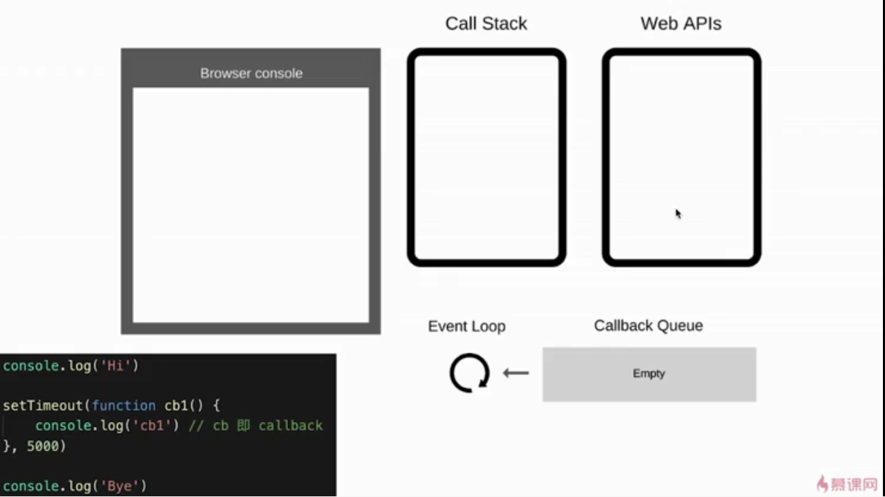

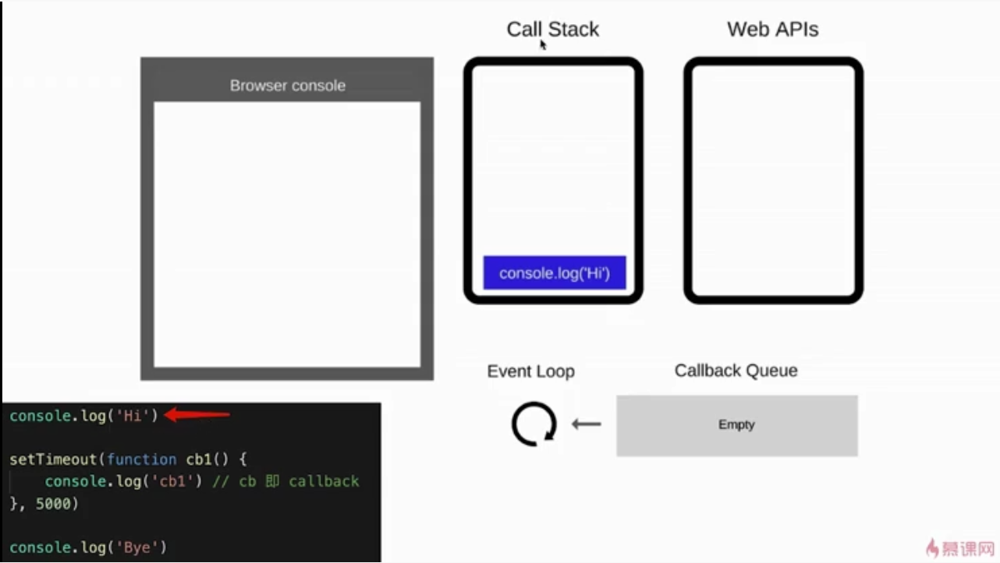

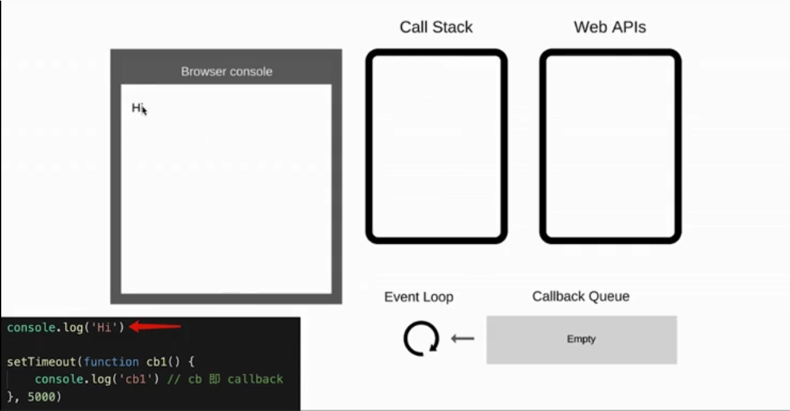

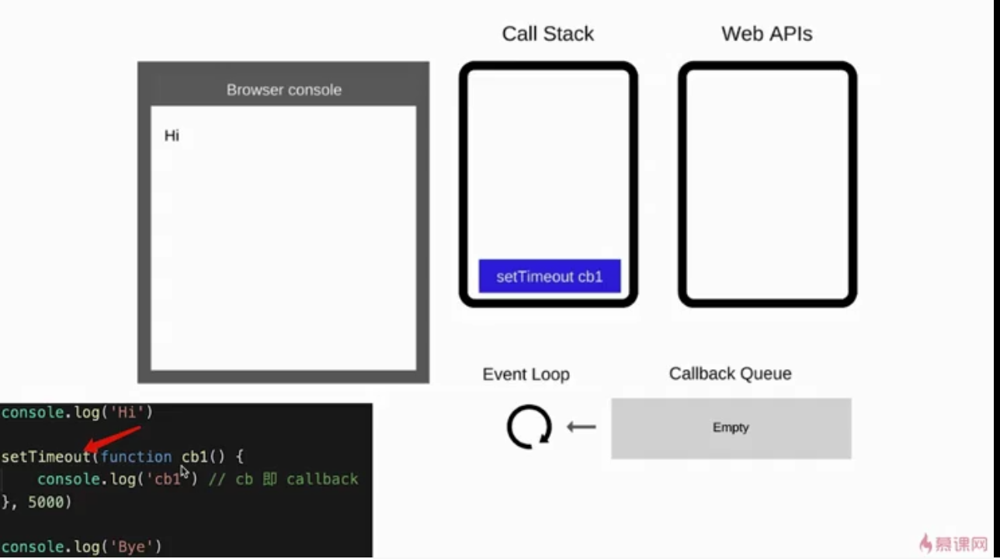

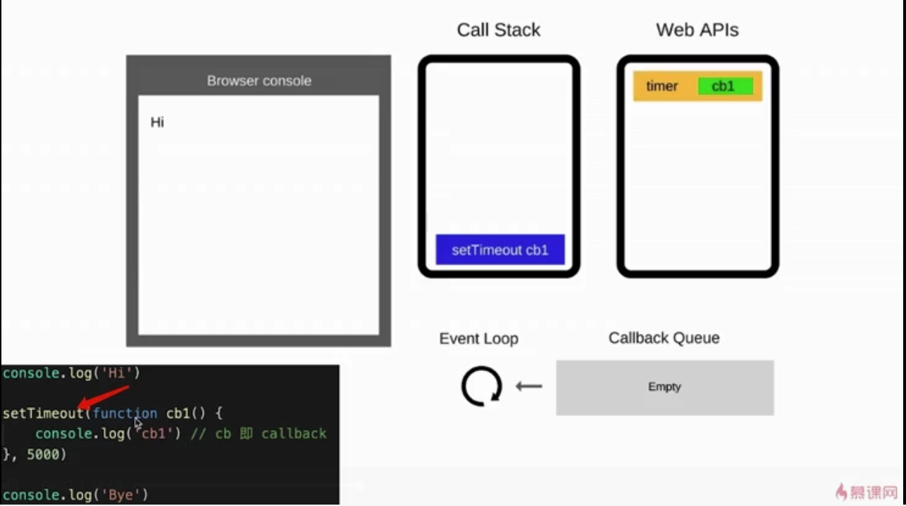

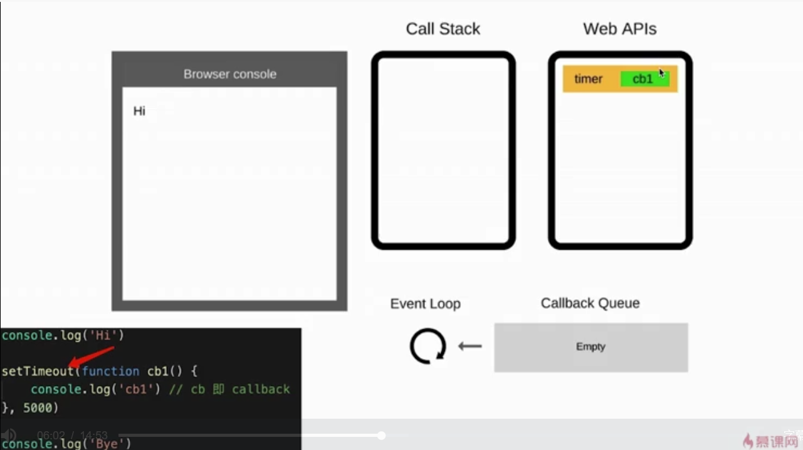


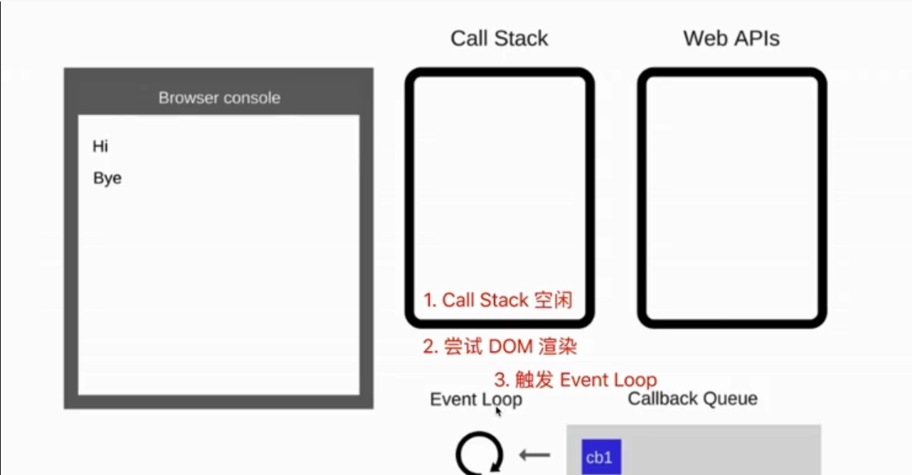

When 5s is done:

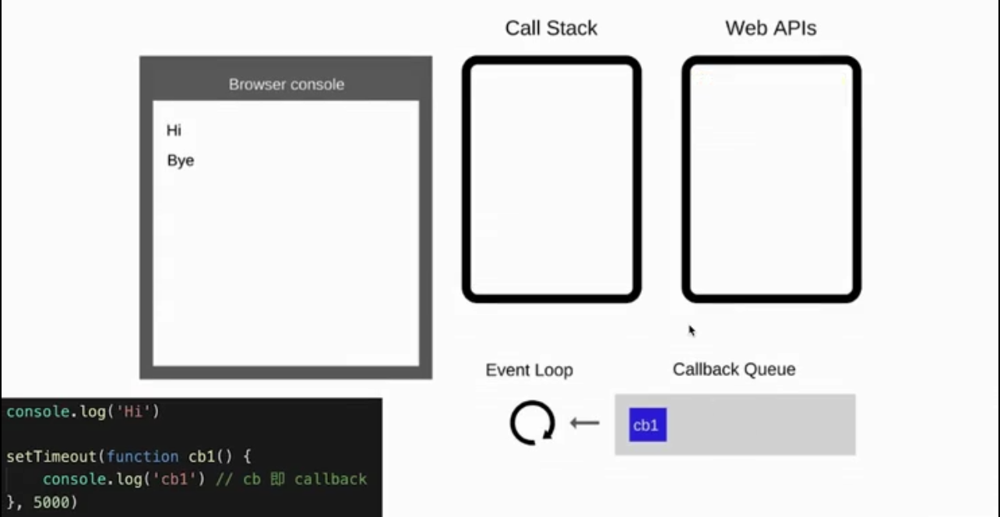

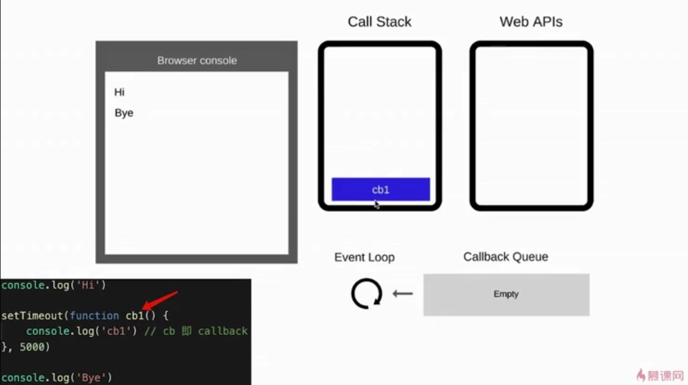

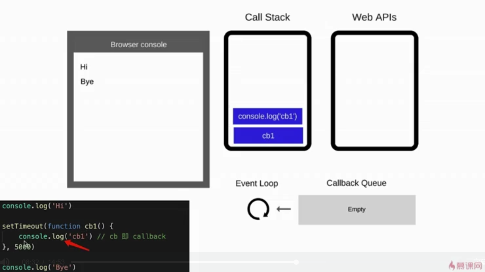

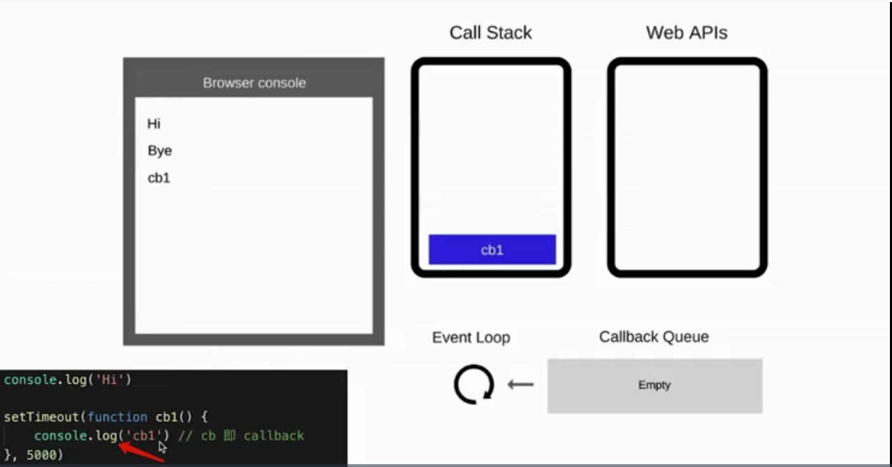

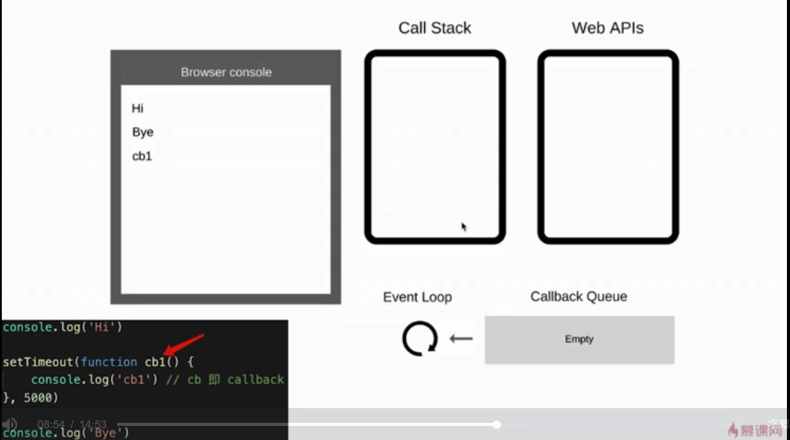

## DOM事件 和 event loop

```markup
<button id="btn"> SUBMIT </button>

<script>
console.log("hi");

$("#btn").click(function (e) {
    console.log("button click"); // 本质是 回调(callback) 
                                 // 差别在于触发时机不一样
                                 // 这里是用户点击则触发
});

console.log("bye");
</script>
```

