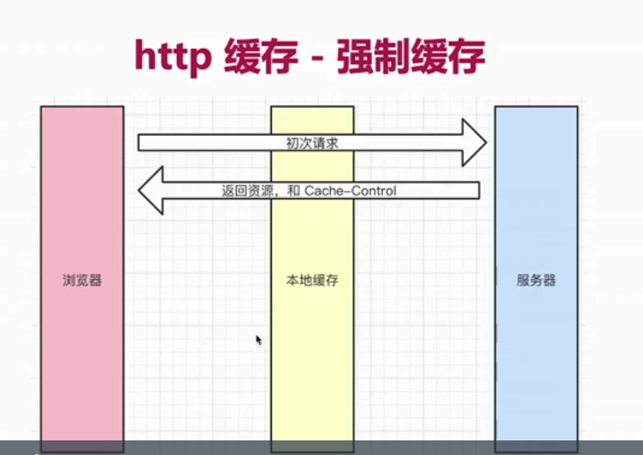
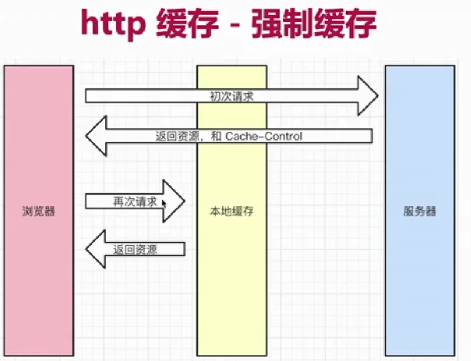
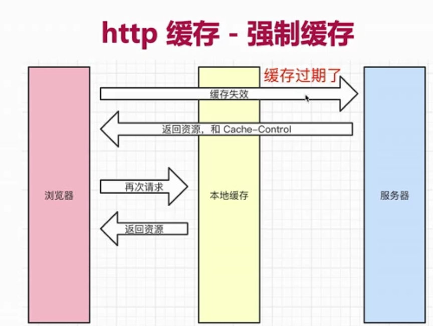
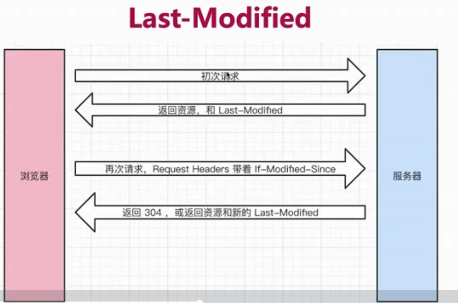
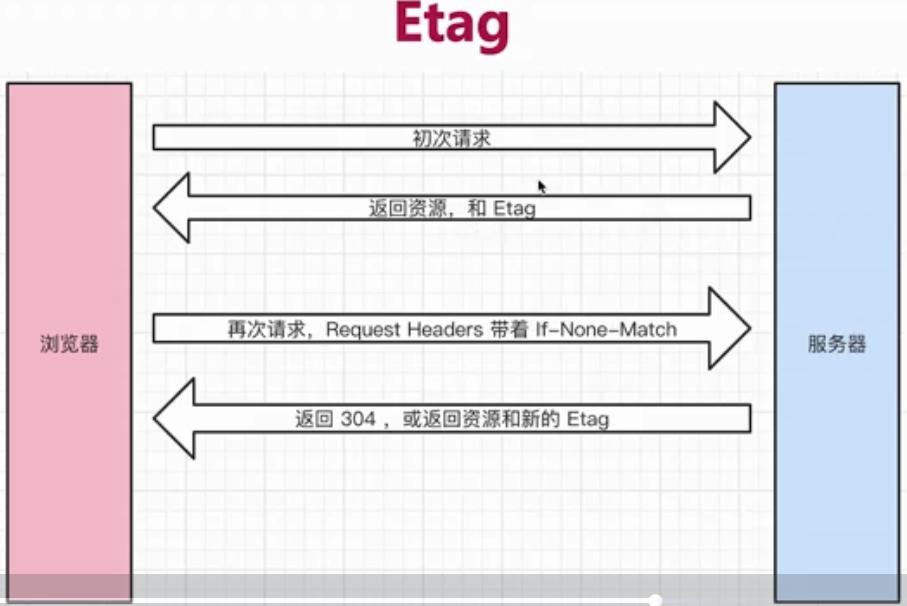
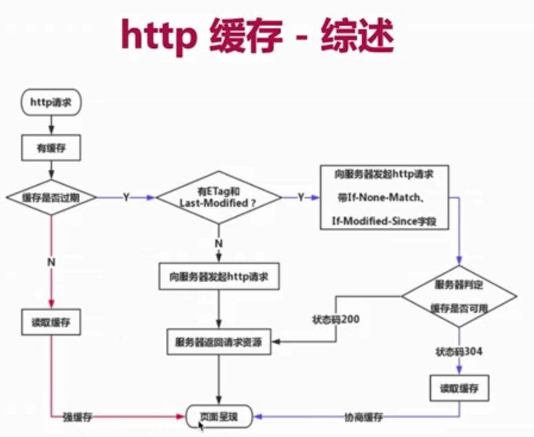

# 13.5 http 缓存


**HTTP caching** occurs when the browser stores local copies of web resources for faster retrieval the next time the resource is required.


## 什么是缓存\(caching\)

Caching is a technique that stores a **copy** of a given resource and serves it back when requested. When a web cache has a requested resource in its store, it intercepts the request and returns its copy instead of re-downloading from the originating server. 

This achieves several goals: 

* it eases the load of the server that doesn’t need to serve all clients itself
* it **improves performance** by being closer to the client, i.e., it takes less time to transmit the resource back. 

For a website, it is a major component in achieving high performance. On the other side, it has to be configured properly as not all resources stay identical forever: it is important to cache a resource only until it changes, not longer.

* 通过缓存减少网络请求的数量 加快页面渲染

## 哪些资源可以被缓存?

* 静态资源 \( js css img \)
* webpack hash 🛩 

## http 缓存策略

### 强制缓存


Cache-Control vs Expires


* **Cache-Control** \(在 response headers 中\)
* eg: _Cache-Control: max-age=31536000_ \(单位是s 1年\)
* Cache-Control的值:
  * **max-age** 设置缓存的最大过期时间
  * **no-cache** 不用强制缓存 直接去找server请求
  * no-store 不用强制缓存 不用server的缓存措施 直接让server简单粗暴返回所有资源 \(不常见\)
  * private 只允许最终用户做缓存
  * public 
* **Expires** \(在 response headers中\) 同为控制缓存过期 _已被 Cache-Control代替_

### 协商缓存 \(对比缓存\)


Last-Modified vs Etag


* **服务器端**缓存策略
* 服务器判断客户端资源 是否和服务端资源一样
* 一致则返回**304** 否则返回200和最新资源

**资源标识** \(是资源的符号\) 

* 在response headers 中
* 有2种:
  * **Last-Modified** 资源的最后修改时间
  * **Etag** 资源的唯一标识 \(一个字符串 类似人的指纹\)
* 这两个可共存 优先使用 Etag
  * Last-Modified只能精确到秒
  * 如果资源被重复生成 而内容不变 则Etag更精确

## 刷新操作方式 对缓存的影响

* 三种刷新操作
  1. 正常操作: 地址栏输入url 跳转连接 前进后退等
  2. 手动刷新: F5 点击刷新按钮 右击菜单刷新 
  3. 强制刷新：ctrl + F5
* 不同刷新操作 不同的缓存策略
  1. 正常操作: 强制缓存有效 协商缓存有效
  2. 手动刷新: 强制缓存失效 协商缓存有效
  3. 强制刷新：强制缓存失效 协商缓存失效

