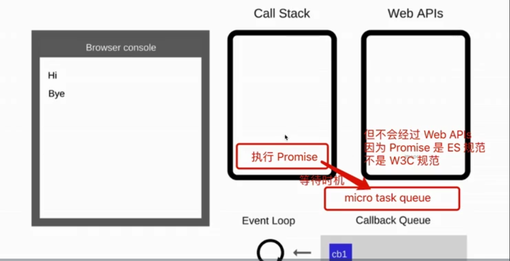
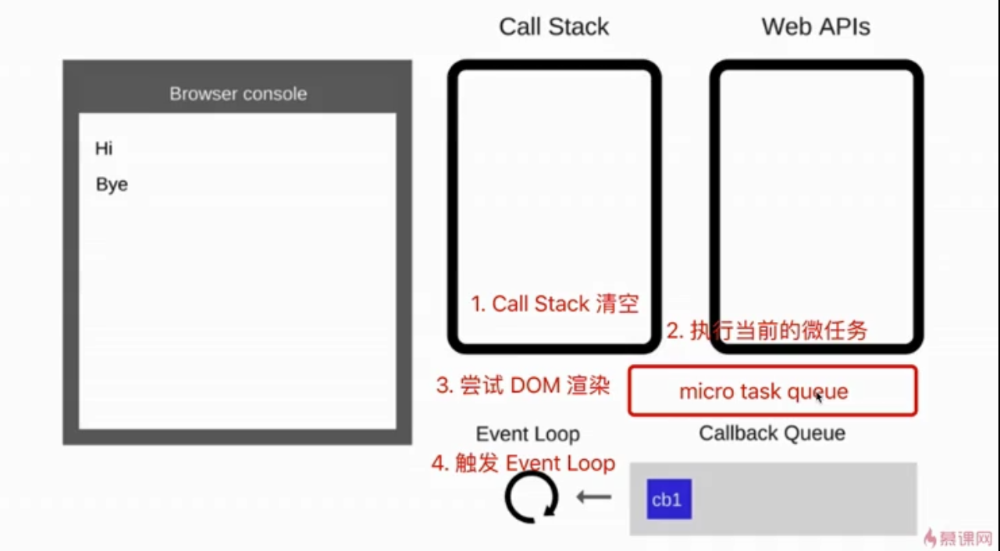

# 7.5 宏任务和微任务

```javascript
console.log(100); 

// 宏任务
setTimeout(() => {
    console.log(200); // 异步回调
});

// 微任务
Promise.resolve().then(() => { // Promise.then 也是异步回调
    console.log(300); 
});

console.log(400);

// 100 400 | 300 200 
//            ?   ?
```

300 后出场， 却比200 先打印， 为什么？

## 宏任务 vs 微任务


* 宏任务: setTimeout, setInterval, Ajax, DOM事件
* 微任务: Promise, async/await


❗ **微任务执行时机比宏任务早**

❗ 区别 \(为什么 微任务执行时机比宏任务早\)

* 宏任务: DOM 渲染**后**触发，如 setTimeout
* 微任务: DOM 渲染**前**触发，如 Promise

🔷 JS 执行的时候，得留一些时机给 **DOM 渲染**

```javascript
// DOM渲染 的 内容
const $p1 = $("<p>一段文字</p>");
const $p2 = $("<p>一段文字</p>");
const $p3 = $("<p>一段文字</p>");

$("#container").append($p1).append($p2).append($p3);

console.log("length", $("#container").children().length); // 3

// 微任务: DOM渲染前触发
Promise.resolve().then(() => {
    console.log("length1",
        $("#container").children().length
    ); // 3
    alert("promise then"); // 此时 DOM 渲染了吗？NO
})

// 宏任务: DOM渲染后触发
setTimeout(() => {
    console.log("length2",
        $("#container").children().length
    ); // 3
    alert("setTimeout"); // 此时 DOM 渲染了吗？YES
})
```

## event loop 和 DOM 渲染

🔷 JS 是单线程的，而且和 DOM 渲染 共用一个线程

🔷 JS 执行的时候，得留一些时机给 DOM 渲染

```javascript
const $p1 = $("<p>一段文字</p>");
const $p2 = $("<p>一段文字</p>");
const $p3 = $("<p>一段文字</p>");

$("#container").append($p1).append($p2).append($p3);

console.log("length", $("#container").children().length); // 3
```

何时执行DOM 渲染？[回顾 event loop 过程 🎦 ](7.1-event-loop.md#event-loop-guo-cheng)

* 每次 call stack 清空 \(即每次轮询结束\)， 即同步任务执行完，再检查是否有微任务
* 如果有微任务，执行
* 执行完微任务， 是DOM重新渲染的机会。 DOM结构如有改变则重新渲染
* 然后再去触发下一次 event loop \(宏任务\)

 对于 宏任务：


 对于 微任务：



总结：



为什么?

* 宏任务: DOM 渲染后触发，如 setTimeout
* 微任务: DOM 渲染前触发，如 Promise

因为

* 宏任务是由浏览器规定的
* 微任务是ES6语法和规定的

```javascript
const $p1 = $("<p>一段文字</p>");
const $p2 = $("<p>一段文字</p>");
const $p3 = $("<p>一段文字</p>");

$("#container").append($p1).append($p2).append($p3);

console.log("length", $("#container").children().length); //3
alert("本次 call stack 结束， DOM 结构已更新， 但尚未触发DOM渲染");
// alert 会阻断JS执行，也会阻断DOM渲染
// 只有当手动确认去结束alert，眼睛才能看到DOM渲染
```

