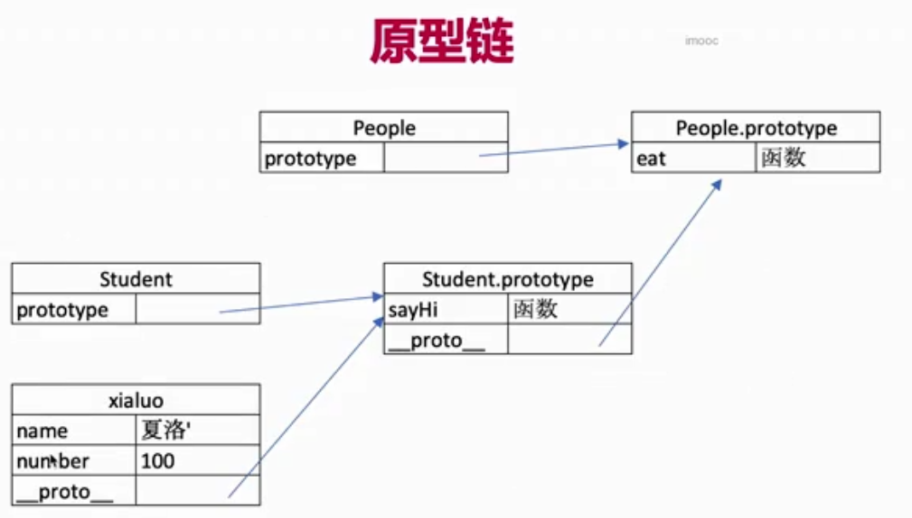
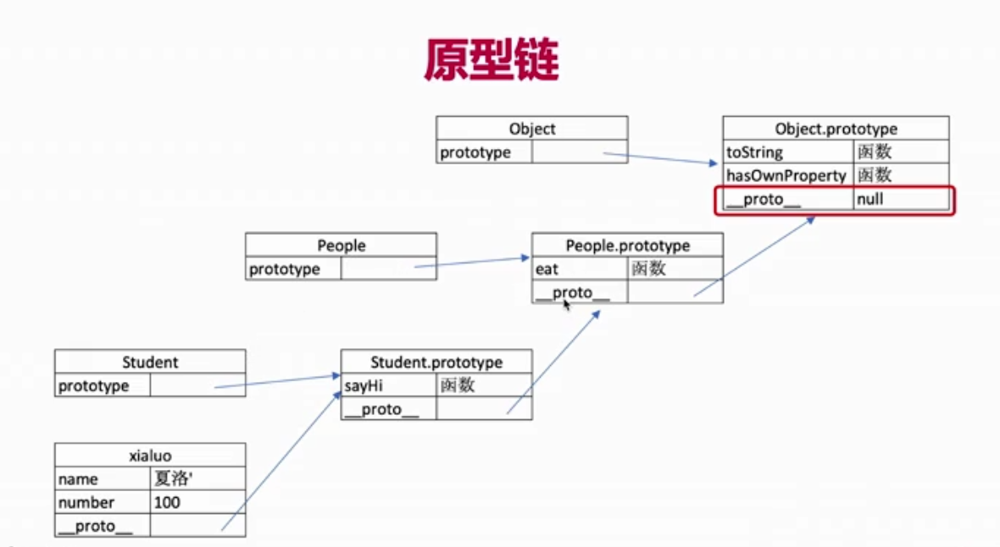

# 4.3 Prototype & Prototype Chain

## Prototype 原型


**Prototypes** are the mechanism by which JavaScript objects **inherit** features from one another


\*\*\*\*📌 **class**的本质是function, 但写法是class的写法

```javascript
typeof People // function
typeof Student // function
```

隐式原型 :  \_\_proto\_\_  
显式原型 : prototype

原型关系：

* 每个class都有prototype
* 每个instance都有**proto**
* instance的**proto**指向对应class的prototype

  ```javascript
  Rdr.__proto__ // People {constructor: f, sayHi: f}
  Student.prototype // People {constructor: f, sayHi: f}
  Rdr.__proto__ === Student.prototype // true
  ```



基于原型的执行规则：当执行 Rdr.name / Rdr.sayHi\(\) 时

* 先在自身properties 和 methods 寻找
* 如果找不到， 则去**proto**中寻找


## Prototype Chain 原型链

```javascript
// People is parent, Student is child
Student.prototype.__proto__
People.prototype
Student.prototype.__proto__ === People.prototype // true
```




```javascript
// 验证
Rdr.hasOwnProperty("name") // true
Rdr.hasOwnProperty("sayHi") // false 
Rdr.hasOwnProperty("eat") // false

Rdr.hasOwnProperty("hasOwnProperty") // false
```




再看 **instanceof**：

```javascript
Rdr instanceof Student // true
Rdr instanceof People // true
Rdr instanceof Object // true
Rdr instanceof Array // false
```

